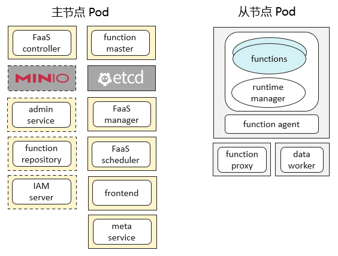

# 在 k8s 上部署 openYuanrong 集群

```{eval-rst}
.. toctree::
   :glob:
   :maxdepth: 1
   :hidden:

   single-node-deployment
   production/index
   api/meta_service/index
```

本节将介绍如何在 Kubernetes 上部署openYuanrong集群。

## 概述

openYuanrong集群由主节点 pod 和从节点 pod 组成。



- 参考[快速部署](./single-node-deployment.md)，使用默认配置在单节点或多节点 Kubernetes 集群上部署openYuanrong。

- 参考[生产部署](./production/index.md)，包含配置项介绍、安全、集群运维等更多内容。

### 主节点 pod

主节点 pod 用于管理集群，负责全局函数调度、请求转发等工作。包含的组件有 function master、FaaS manager、FaaS scheduler、FaaS controller、fronted、meta service、admin service、IAM adaptor 及开源 MinIO、etcd。

### 从节点 pod

从节点 pod 用于运行分布式任务，部署的openYuanrong组件有 function agent、function proxy、data worker 及 runtime manager。

### 组件介绍

- **function master**

  负责拓扑管理、全局函数调度、函数实例生命周期管理及 function agent 组件的扩缩容。部署形式为 [Deployment](https://kubernetes.io/zh-cn/docs/concepts/workloads/controllers/deployment/){target="_blank"}，一主多备。
- **FaaS manager**

  负责租约申请与回收，清理过期连接信息。它是由 FaaS controller 创建的openYuanrong系统函数。
- **FaaS scheduler**

  负责 FaaS 函数的调度。它是由 FaaS controller 创建的openYuanrong系统函数。
- **frontend**

  提供 REST API 用于函数调用、流订阅等数据处理。它是由 FaaS controller 创建的openYuanrong系统函数。
- **meta service**

  提供 REST API 用于函数创建、资源池创建等管理操作。部署形式为 [Deployment](https://kubernetes.io/zh-cn/docs/concepts/workloads/controllers/deployment/){target="_blank"}。
- **meta service**

  提供部署函数接口，当前仅在用命令工具 yr 部署函数时使用。可以不部署，使用 meta service 组件提供的函数管理 API 替代，该组件即将废弃。
- **IAM adaptor**

  负责多租鉴权与认证。部署形式为 [Deployment](https://kubernetes.io/zh-cn/docs/concepts/workloads/controllers/deployment/){target="_blank"}，一主多备。如果无相关需求或已有认证鉴权平台，可以不部署。
- **etcd**

  第三方开源组件，用于存储集群组件注册信息、函数元数据以及实例状态等信息。
- **function proxy**

  负责消息转发、本地函数调度及实例生命周期管理。部署形式为 [DaemonSet](https://kubernetes.io/zh-cn/docs/concepts/workloads/controllers/daemonset/){target="_blank"}。
- **data worker**

  提供数据对象的存取等能力。部署形式为 [DaemonSet](https://kubernetes.io/zh-cn/docs/concepts/workloads/controllers/daemonset/){target="_blank"}。

### Pod 资源池

Pod 资源池用于运行函数实例，原理上基于 K8s Deployment 工作负载实现，包括 function agent 和 function manager 两个容器镜像。根据您实际业务函数需要，可以在部署时配置 Pod 资源池的 CPU、内存、副本数量等信息，也可以通过[资源池管理 API](api/meta_service/index.md) 在部署后动态创建。
